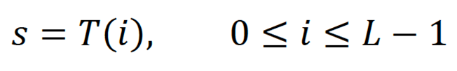
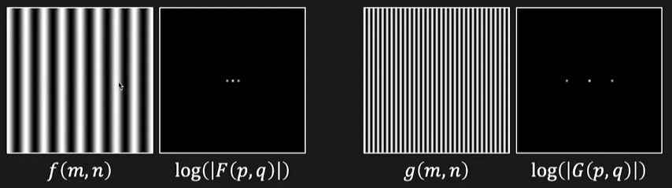
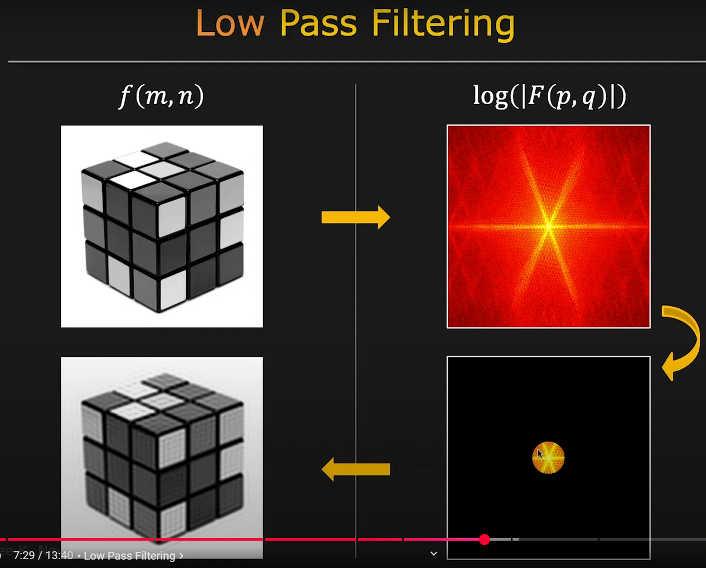
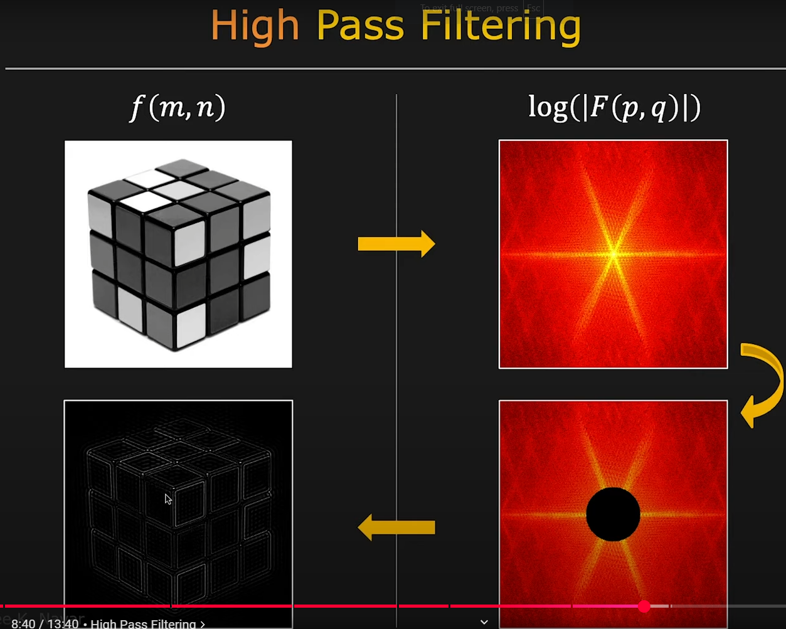

# Hoofdstuk 1

## Image Sampling & Quantization

The process of turning the real world into an image involves sampling and quantization. The real world has infinite resolution, and through sampling and quantization, we can describe it at a specific resolution.

### Spatial Resolution (DPI or PPI)
Spatial resolution refers to the level of detail an image holds, measured in dots per inch (DPI) or pixels per inch (PPI). It determines how closely lines can be resolved in an image. Higher spatial resolution means more detail is captured, but it requires more storage and processing power.

### Intensity Resolution (Bit Depth)
Intensity resolution refers to the number of bits used to represent each pixel's intensity. Bit depth determines the range of possible intensity values, affecting the image's tonal range. For example:
- 1-bit depth: Black or white only.
- 8-bit depth: 256 possible intensity levels.
Higher bit depths allow for smoother gradients and more accurate color representation.

## Color Models

### Gamma
```Gamma correction adjusts the brightness of an image by transforming pixel intensity values. It is commonly used to ensure consistent brightness across different devices and to account for non-linear human perception of light.```

> this needs to change

### Color Models
- **RGB (Red, Green, Blue):** 
  Each pixel has three values ranging from 0 to 255, representing red, green, and blue intensities. Higher values correspond to brighter colors.  
- **Grayscale (1 Channel Intensity Information):** 
  Converts an RGB image into shades of gray using the formula:  `Y = 0.299 × R + 0.587 × G + 0.114 × B`

### Rubik's Cube Solver
```In applications like a Rubik's Cube solver, color spaces play a critical role. The RGB model is sensitive to brightness changes; altering the brightness of a scene directly impacts color values. However, color spaces that separate brightness from color, such as HSV (Hue, Saturation, Value), isolate brightness adjustments without affecting color values, enabling more consistent color detection.```

> this needs to change

# Hoofdstuk 2

## Global, Point and local Filters

- **Global Filter:** Global filters process the entire image to generate a new image. The output at any pixel depends on the information from the entire image. 
  `Example: Histogram equalization.`  

- **Point Filter:** Point filters process each pixel individually. The output pixel is calculated based solely on the value of the corresponding input pixel at the same location.
  `Example: Brightness adjustment by adding a constant to all pixel values.`

- **Local Filter:** Local filters consider a specific neighborhood (a grid) around a pixel and calculate the output pixel based on the values within that grid. The result is assigned to the center pixel.  
  `Example: convolution or Smoothing filters like the Gaussian blur or sharpening filters.`

## Distance in an Image
- **Euclidean Distance:** Straight-line distance between two points.  
- **City Block Distance:** Distance measured along axes at right angles (Manhattan distance).  
- **Chessboard Distance:** Maximum distance along any dimension.

## Histogram  
A histogram plots the frequency of each intensity value in an image, providing a visual representation of the tonal distribution. It helps analyze the brightness and contrast of an image by showing how pixel intensities are distributed.  

#### Histogram Equalization  
Histogram equalization is a technique to improve image contrast by spreading intensity values more uniformly across the available range. The basic function is:  

  

- **I:** Original intensity  
- **S:** New intensity  
- **L:** Maximum intensity level  

The most common transfer function used is the **Cumulative Distribution Function (CDF)**:  

  

This ensures the histogram is redistributed to improve the contrast, resulting in a more balanced image appearance.


## Smoothing & Sharpening Filters

### Image Borders
When applying filters, borders need special handling:
- **Ignore Borders:** Skip processing at the edges.
- **Zero Padding:** Fill border areas with zeros.
- **Extended Value Padding:** Extend edge pixel values to the border.
- **Mirror Value Padding:** Mirror the pixel values at the border.

### Smoothing Filters
- **Averaging Filter:** Replaces each pixel with the average of neighboring pixels to reduce noise.  
- **Median Filter:** Replaces each pixel with the median of neighboring values, preserving edges better than averaging.  
- **Gaussian Filter:** Applies a weighted average based on a Gaussian distribution for smooth transitions.

### Sharpening Filters
- **Differential Filter:** this is a spatial filter that uses the first differential  
- **Laplacian 2D Filter:** this is a spatial filter that uses the second differential.  
- **Unsharpening Filter:** subtracts a blurred version of the image with the original to get a unsharp mask this mask then gets added to the original picturel.
> check uitleg van laplacian

# Hoofdstuk 3

## 2D Fourier Transform  
The 2D Fourier Transform is a mathematical technique that converts an image from the spatial domain (where pixel intensities represent the image) into the frequency domain (where values represent the amplitude and phase of different frequency components). It is widely used in image processing for filtering, analysis, and compression.  

### How It Works  
The transform decomposes the image into a sum of sinusoidal functions with varying frequencies. The output frequency domain representation provides:  



- **Low frequencies:** Represent smooth variations and the overall structure of the image, located at the center.  
- **High frequencies:** Represent fine details, edges, and noise, located around the center.  

### Axes in the Frequency Domain  
- **X-axis (Horizontal Frequencies):** Represents intensity variations along the horizontal direction in the image.  
- **Y-axis (Vertical Frequencies):** Represents intensity variations along the vertical direction in the image.  

## Low-Pass Filters (Smooth Filters)  
Low-pass filters are used to remove high-frequency components (e.g., noise and edges), resulting in a smoother image.  

- **Ideal Low-Pass Filter:** A sharp cutoff filter that allows all frequencies below a certain threshold to pass and blocks others completely.  
- **Butterworth Low-Pass Filter:** A smoother transition between passed and blocked frequencies, controlled by its order.  
- **Gaussian Low-Pass Filter:** Applies a Gaussian function to frequencies, providing smooth attenuation of higher frequencies.  

## High-Pass Filters (Edge Detection)  
High-pass filters are used to remove low-frequency components, enhancing edges and fine details in the image.  

- **Ideal High-Pass Filter:** Blocks all frequencies below a threshold and allows higher frequencies to pass.  

- **Butterworth High-Pass Filter:** Provides a gradual transition between blocked and passed frequencies, depending on its order.  

- **Gaussian High-Pass Filter:** Smoothly attenuates low frequencies using a Gaussian function.  

- **Laplacian Filter:** Detects edges by computing the second derivative of the image, highlighting areas of rapid intensity change.

  

## Bandreject Filter
A bandreject filter blocks a specific range of frequencies, leaving the remaining frequencies intact. It is commonly used to remove specific patterns or interference in an image.

### Moiré Pattern
The Moiré pattern is an interference pattern caused by overlapping grids or repetitive structures in an image. It often appears during image resizing or scanning and can be mitigated using bandreject filters.


# Chapter 4

## Compression
Compression is a technique used to reduce the size of large data packets through clever methods.

### Lossy vs Lossless
- **Lossy**: A compression technique where data is lost during the process, meaning you cannot revert to the original state of the image. 
  - **Compression ratio: **x > 10
  - **Requires **less computational power.
  
- **Lossless**: A compression technique where no data is lost during the process, allowing you to restore the original state of the image.
  - **Compression ratio: **x < 10
  - **Requires **more computational power.

## JPEG compressie 


JPEG compression uses several steps to reduce image size while maintaining visual quality:

1. **Switching Color Space:** Converts the image from RGB to a color space like YCbCr to separate brightness (Y) from color information (Cb and Cr).
2. **Blocks:** Divides the image into small blocks (e.g., 8x8 pixels) for localized processing.
3. **Discrete Cosine Transform (DCT):** Transforms the pixel values into frequency components, emphasizing low frequencies and minimizing high frequencies.
4. **Quantization via Quantization Tables:** Reduces precision of high-frequency components using predefined quantization tables, achieving significant compression.
5. **Zig-Zag (Run-Length Encoding):** Arranges frequency components in a zig-zag order to group similar values, enabling efficient run-length encoding.
6. **Huffman Encoding:** Applies entropy-based encoding to further compress the data by reducing redundancy.
