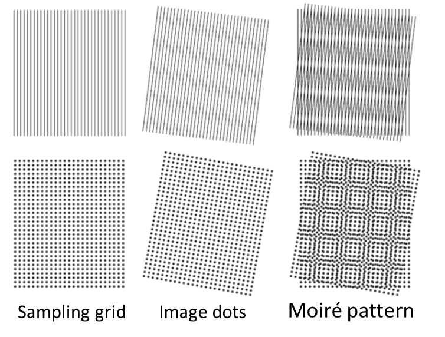
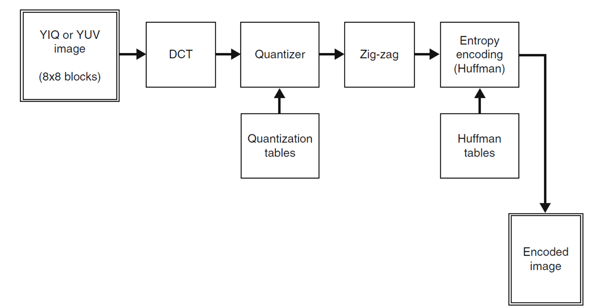

# Hoofdstuk 1

## Image Sampling & Quantization

The process of turning the real world into an image involves sampling and quantization. The real world has infinite resolution, and through sampling and quantization, we can describe it at a specific resolution.

### Spatial Resolution (DPI or PPI)
Spatial resolution refers to the level of detail an image holds, measured in dots per inch (DPI) or pixels per inch (PPI). It determines how closely lines can be resolved in an image. Higher spatial resolution means more detail is captured, but it requires more storage and processing power.

### Intensity Resolution (Bit Depth)
Intensity resolution refers to the number of bits used to represent each pixel's intensity. Bit depth determines the range of possible intensity values, affecting the image's tonal range. For example:
- 1-bit depth: Black or white only.
- 8-bit depth: 256 possible intensity levels.
Higher bit depths allow for smoother gradients and more accurate color representation.

## Color Models

### Gamma
```Gamma correction adjusts the brightness of an image by transforming pixel intensity values. It is commonly used to ensure consistent brightness across different devices and to account for non-linear human perception of light.```
> this needs to change

### Color Models
- **RGB (Red, Green, Blue):** 
  Each pixel has three values ranging from 0 to 255, representing red, green, and blue intensities. Higher values correspond to brighter colors.  
- **Grayscale (1 Channel Intensity Information):** 
  Converts an RGB image into shades of gray using the formula:  `Y = 0.299 × R + 0.587 × G + 0.114 × B`

### Rubik's Cube Solver
```In applications like a Rubik's Cube solver, color spaces play a critical role. The RGB model is sensitive to brightness changes; altering the brightness of a scene directly impacts color values. However, color spaces that separate brightness from color, such as HSV (Hue, Saturation, Value), isolate brightness adjustments without affecting color values, enabling more consistent color detection.```
> this needs to change

# Hoofdstuk 2

## Global and Point Filters

Point filters apply operations to individual pixels (can still take a grid in for example convolutions), while global filters consider the entire image. These methods enhance image quality or extract specific features.

## Distance in an Image
- **Euclidean Distance:** Straight-line distance between two points.  
- **City Block Distance:** Distance measured along axes at right angles (Manhattan distance).  
- **Chessboard Distance:** Maximum distance along any dimension.

## Histogram
A histogram plots the frequency of each intensity value in an image, providing a visual representation of tonal distribution.

#### Histogram Equalization
A technique to improve image contrast by spreading intensity values more uniformly across the range.
> needs to be more explained

## Smoothing & Sharpening Filters

### Image Borders
When applying filters, borders need special handling:
- **Ignore Borders:** Skip processing at the edges.
- **Zero Padding:** Fill border areas with zeros.
- **Extended Value Padding:** Extend edge pixel values to the border.
- **Mirror Value Padding:** Mirror the pixel values at the border.

### Smoothing Filters
- **Averaging Filter:** Replaces each pixel with the average of neighboring pixels to reduce noise.  
- **Median Filter:** Replaces each pixel with the median of neighboring values, preserving edges better than averaging.  
- **Gaussian Filter:** Applies a weighted average based on a Gaussian distribution for smooth transitions.

### Sharpening Filters
- **Differential Filter:** this is a spatial filter that uses the first differential  
- **Laplacian 2D Filter:** this is a spatial filter that uses the second differential.  
- **Unsharpening Filter:** subtracts a blurred version of the image with the original to get a unsharp mask this mask then gets added to the original picturel.
> check uitleg van laplacian

# Hoofdstuk 3

## 2D fourfier transform
explain how it works
> check uitleg van laplacian

### Axes in the Frequency Domain
- **X-axis (Horizontal Frequencies):** Represents the variation of intensity along the horizontal direction in the image.  
- **Y-axis (Vertical Frequencies):** Represents the variation of intensity along the vertical direction in the image. 

## Low pas filters (smooth filters)
>explain give maybe names

## High pas filters (edge detection)
>explain give maybe names

## Bandreject Filter
A bandreject filter blocks a specific range of frequencies, leaving the remaining frequencies intact. It is commonly used to remove specific patterns or interference in an image.

### Moiré Pattern
The Moiré pattern is an interference pattern caused by overlapping grids or repetitive structures in an image. It often appears during image resizing or scanning and can be mitigated using bandreject filters.



# Chapter 4

## Compression
Compression is a technique used to reduce the size of large data packets through clever methods.

### Lossy vs Lossless
- **Lossy**: A compression technique where data is lost during the process, meaning you cannot revert to the original state of the image. 
  - **Compression ratio: **x > 10
  - **Requires **less computational power.
  
- **Lossless**: A compression technique where no data is lost during the process, allowing you to restore the original state of the image.
  - **Compression ratio: **x < 10
  - **Requires **more computational power.

## JPEG compressie 



- **Switching Color Space**  
  The image is converted from the RGB color space to the YCbCr color space.  
  - Y (luminance) contains brightness information.  
  - Cb and Cr (chrominance) contain color information.  
  This separation allows for better compression as the human eye is less sensitive to color variations than brightness.

- **Blocks**  
  The image is divided into small blocks, typically 8x8 pixels.  
  - Each block is processed individually, making the compression manageable and efficient.  

- **Discrete Cosine Transform (DCT)**  
  Converts the pixel values in each block into frequency components.  
  - Lower frequencies represent important image details.  
  - Higher frequencies represent finer details, which can be compressed more aggressively.

- **Quantization via Quantization Tables**  
  The frequency components are scaled down using a quantization table.  
  - Larger reductions are applied to higher frequencies, as they are less noticeable to the human eye.  
  - This step introduces most of the data loss in JPEG compression.

- **Zig-Zag (Run Length Encoding)**  
  After quantization, the coefficients are read in a zig-zag order to group zeros together.  
  - This optimizes the data for further compression by clustering similar values.

- **Huffman Encoding**  
  The remaining values are encoded using Huffman coding, a lossless compression method.  
  - Frequently occurring values are given shorter codes, reducing the overall file size.
